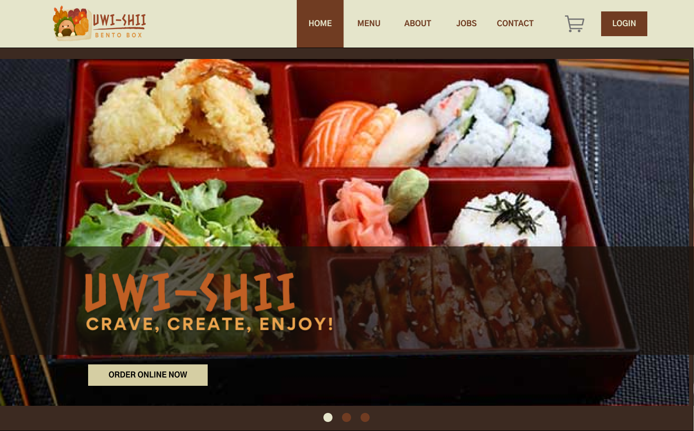
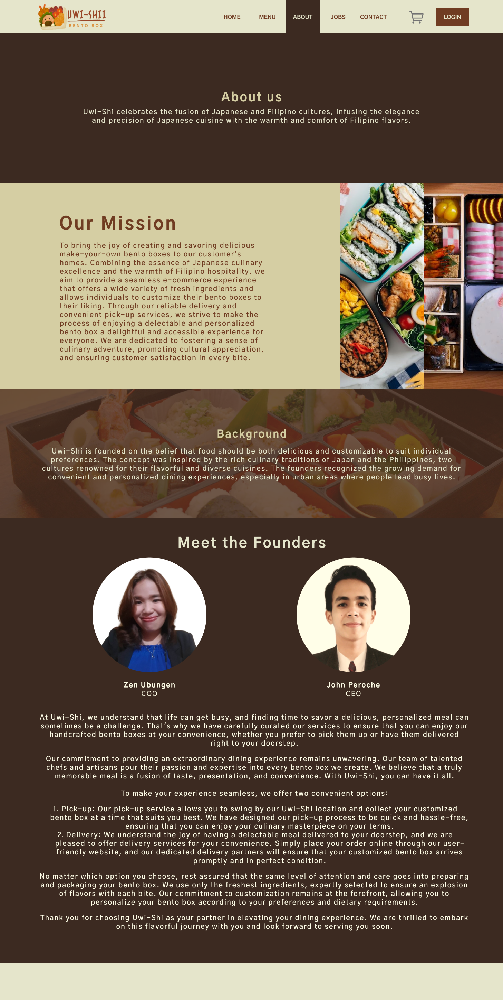

# UWI-SHI - CRAVE, CREATE and ENJOY
<i>A Project for completion of COSC-FE2 - CS Free Elective 2 (E-Commerce)</i>

### Description:
 A Bento-box restaurant themed website which aims to streamline the creative creation and ordering of bento-boxes.

#### Features:
- Navigate Pages
- Login and Register
- Customize orders
- Add to Cart
- Review Cart
- Remove Order
- Add Quantity
- Place Order
- Send Email

### Collaborators:

- John Mark Peroche
- Zen Desiree Ubungen 

### Tools:
- Django
- SQLite

### Screenshots:

####  HomePage

####  ADD to CART

####  REVIEW CART

####  AboutPage

